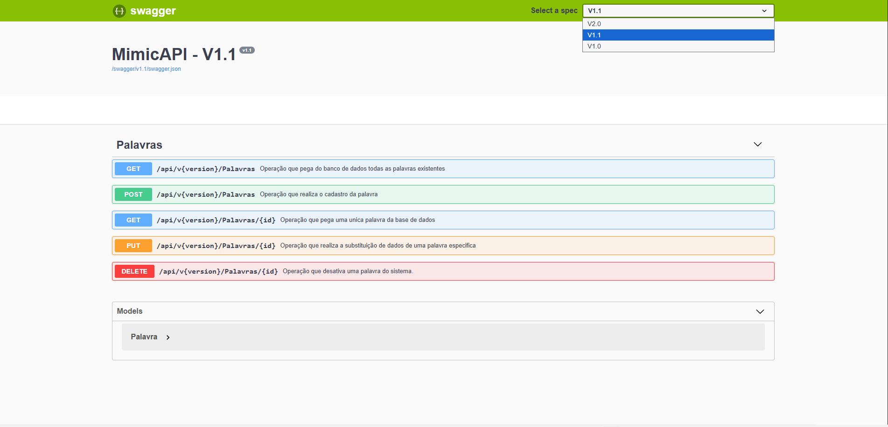

# 🐣 MimicAPI

## 📌 Visão Geral

MimicAPI é uma API RESTful desenvolvida com ASP.NET Core (Web API), usando arquitetura com versionamento de API, banco de dados SQLite e documentação de API via Swagger.

O projeto está no folder `Secao 01/01_fim/MimicAPI/MimicAPI` no workspace.


## 🧩 Tecnologias Utilizadas

- .NET Core 2.0 (TargetFramework: `netcoreapp2.0`)
- SDK: `Microsoft.NET.Sdk.Web`
- Entity Framework Core (SQLite)
- AutoMapper
- API Versioning (`Microsoft.AspNetCore.Mvc.Versioning` + ApiExplorer)
- Swagger (Swashbuckle)


## 🛠️ Dependências (package references)

- `AutoMapper` v9.0.0
- `Microsoft.AspNetCore.All` v2.0.9
- `Microsoft.AspNetCore.Mvc.Versioning` v3.1.6
- `Microsoft.AspNetCore.Mvc.Versioning.ApiExplorer` v3.2.1
- `Microsoft.EntityFrameworkCore.Sqlite` v2.2.6
- `Microsoft.EntityFrameworkCore.Tools` v2.2.6
- `Swashbuckle.AspNetCore` v4.0.1


## 🧾 SDK / Versão do Projeto

- TargetFramework: `netcoreapp2.0`
- SDK: .NET Core SDK 2.0.x (recomendado `2.1.x` ou `2.2.x` para compatibilidade com bibliotecas, mas o projeto foi construído para .NET Core 2.x)
- Verifique com:

```bash
dotnet --version
```


## 🚀 Instalação e execução

1. Clone o repositório (substitua pelo URL real do seu repositório):

```bash
git https://github.com/marcionavarro/asp-netcore-webapi
cd Secao 01/01_fim/MimicAPI/MimicAPI
```

2. Abra um terminal no diretório da solução:

```bash
cd "F:/asp-netcore-webapi/Secao 01/01_fim/MimicAPI/MimicAPI"
```

3. Restaure pacotes:

```bash
dotnet restore
```

3. (Opcional, se quiser atualizar banco via migrations):

```bash
dotnet ef database update
```

4. Rode a aplicação:

```bash
dotnet run
```

5. Acesse a swagger UI:

- `http://localhost:5000`
- ou `http://localhost:5001` (HTTPS, dependendo da configuração)


## 🔧 Estrutura de pastas

- `Startup.cs` — configura serviços, Swagger, AutoMapper, EF Core e versionamento de API
- `Program.cs` — inicialização do host
- `Database/MimicContext.cs` — DbContext EF Core com DbSet<Palavra>
- `Helpers/` — utilitários como mapeamento DTO, paginação, Swagger filter
- `V1/Controllers` e `V2/Controllers` — controladores (versões da API)
- `Migrations/` — migrações EF Core


## 🧪 Endpoints (padrão)

- API versionada usando header `api-version`
- Swagger doc:
  - `/swagger/v2.0/swagger.json`
  - `/swagger/v1.1/swagger.json`
  - `/swagger/v1.0/swagger.json`


## 📷 Screenshots

