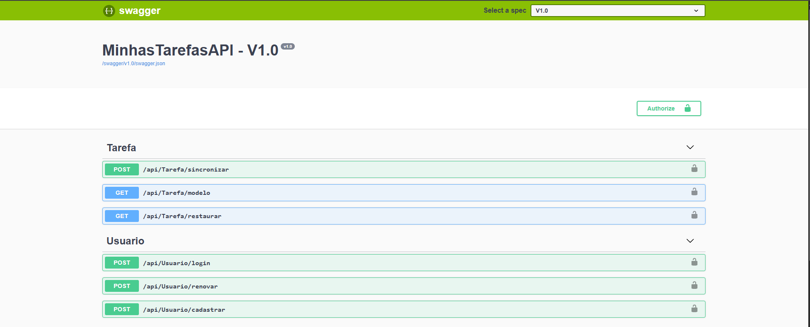
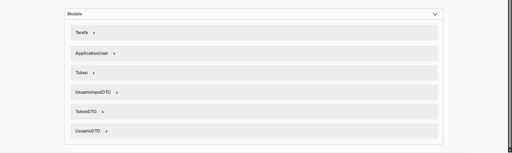

# 📋 MinhasTarefasAPI

Uma API RESTful robusta e segura para gerenciamento de tarefas, desenvolvida com **ASP.NET Core** e integrada com autenticação JWT, versionamento de API e documentação interativa via Swagger.

## 🚀 Sobre a Aplicação

MinhasTarefasAPI é uma solução completa para gerenciamento de tarefas e usuários. A aplicação foi construída seguindo melhores práticas de desenvolvimento, incluindo:

- ✅ Autenticação e autorização com JWT (JSON Web Token)
- ✅ Versionamento de API para melhor manutenção
- ✅ Banco de dados SQLite com Entity Framework Core
- ✅ Documentação interativa com Swagger UI
- ✅ Arquitetura em camadas com Repositories
- ✅ Suporte a XML e JSON no conteúdo da resposta

## 🛠️ Tecnologias Utilizadas

| Tecnologia | Versão | Descrição |
|------------|--------|-----------|
| **.NET Core** | 2.0 | Framework principal |
| **ASP.NET Core** | 2.0.9 | Framework web |
| **Entity Framework Core** | 2.2.6 | ORM para acesso a dados |
| **SQLite** | 2.2.6 | Banco de dados |
| **Swagger/Swashbuckle** | 4.0.1 | Documentação interativa da API |
| **JWT Bearer** | 2.x | Autenticação segura |
| **Microsoft Identity** | 2.2.0 | Gerenciamento de usuários e roles |
| **API Versioning** | 3.1.6 | Suporte a versionamento |

## 📥 Instalação

### Pré-requisitos

- [.NET Core SDK 2.0](https://www.microsoft.com/net/download/windows) ou superior
- [Git](https://git-scm.com/)
- [Visual Studio 2017+](https://visualstudio.microsoft.com/) ou [Visual Studio Code](https://code.visualstudio.com/)

### Passos para Instalação

**1. Clone o repositório:**
```bash
git clone https://github.com/marcionavarro/asp-netcore-webapi
cd Secao 02/01_Fim/MinhasTarefasAPI/MinhasTarefasAPI
```

**2. Navegue até o diretório do projeto:**
```bash
cd Secao 02/01_Fim/MinhasTarefasAPI/MinhasTarefasAPI/
```

**3. Restaure as dependências:**
```bash
dotnet restore
```

**4. Configure o banco de dados:**

Abra o **Package Manager Console** no Visual Studio e execute:
```powershell
Add-Migration BancoInicial
Update-Database
```

Ou via CLI:
```bash
dotnet ef migrations add BancoInicial
dotnet ef database update
```

## ▶️ Como Executar

### Via Visual Studio

1. Abra o arquivo `MinhasTarefasAPI.sln` no Visual Studio
2. Clique em **Build** > **Build Solution**
3. Pressione **F5** ou clique no botão **Start** para iniciar a aplicação

### Via CLI (.NET Core)

```bash
dotnet run
```

A aplicação iniciará em `http://localhost:5000` ou a porta configurada em `launchSettings.json`.

### Acessar o Swagger UI

Após iniciar a aplicação, acesse a documentação interativa:

```
http://localhost:porta/index.html
```

## 📚 Estrutura do Projeto

```
MinhasTarefasAPI/
├── Controllers/          # Controladores da API
├── Models/              # Modelos de dados e ViewModels
├── Repositories/        # Camada de acesso a dados
├── Database/            # Contexto do EF Core
├── Migrations/          # Migrações do banco de dados
├── Properties/          # Configurações do projeto
├── appsettings.json     # Configurações da aplicação
├── Startup.cs           # Configuração de serviços
├── Program.cs           # Ponto de entrada
└── README.md            # Esta documentação
```

## 🔐 Autenticação

A API utiliza **JWT (JSON Web Token)** para autenticação. Os endpoints protegidos requerem o token no header:

```
Authorization: Bearer seu_token_aqui
```

### Exemplo de Requisição Autenticada

```bash
curl -X GET "http://localhost:5000/api/v1/tarefas" \
  -H "Authorization: Bearer seu_token_aqui" \
  -H "api-version: 1.0"
```

## 📸 Screenshots




### Dashboard Swagger UI
- Documentação completa de todos os endpoints
- Possibilidade de testar as requisições diretamente
- Informações sobre autenticação e segurança

## 🆔 Versão do SDK

- **Target Framework**: `netcoreapp2.0`
- **SDK Mínimo Requerido**: .NET Core 2.0
- **Versão Recomendada**: .NET Core 2.0.9+

Verifique a versão instalada:
```bash
dotnet --version
```

## 📝 Endpoints Principais

### Usuários
- `POST /api/v1/usuarios` - Criar novo usuário
- `GET /api/v1/usuarios/{id}` - Obter usuário por ID
- `PUT /api/v1/usuarios/{id}` - Atualizar usuário
- `DELETE /api/v1/usuarios/{id}` - Deletar usuário

### Tarefas
- `GET /api/v1/tarefas` - Listar todas as tarefas
- `POST /api/v1/tarefas` - Criar nova tarefa
- `PUT /api/v1/tarefas/{id}` - Atualizar tarefa
- `DELETE /api/v1/tarefas/{id}` - Deletar tarefa

### Autenticação
- `POST /api/v1/autenticacao/login` - Gerar token JWT
- `POST /api/v1/autenticacao/refresh` - Renovar token

## 🗄️ Banco de Dados

O projeto utiliza **SQLite** para armazenamento de dados local.

- **Arquivo do Banco**: `Database/MinhasTarefas.db`
- **Migrações**: Pasta `Migrations/`

Para gerenciar o banco graficamente, utilize [DB Browser for SQLite](https://sqlitebrowser.org/).

## 🐛 Troubleshooting

### Erro: "Migration not found"
```bash
# Adicione a migração
dotnet ef migrations add BancoInicial

# Atualize o banco
dotnet ef database update
```

### Erro: "Porto já está em uso"
Altere a porta em `Properties/launchSettings.json`

### Erro: "Arquivo XML de documentação não encontrado"
O arquivo `MinhasTarefasAPI.xml` é gerado automaticamente durante o build. Execute:
```bash
dotnet build
```

## 📦 Dependências Principais

```xml
<PackageReference Include="Microsoft.AspNetCore.All" Version="2.0.9" />
<PackageReference Include="Microsoft.AspNetCore.Identity" Version="2.2.0" />
<PackageReference Include="Microsoft.AspNetCore.Mvc.Versioning" Version="3.1.6" />
<PackageReference Include="Microsoft.EntityFrameworkCore.Sqlite" Version="2.2.6" />
<PackageReference Include="Swashbuckle.AspNetCore.Swagger" Version="4.0.1" />
```